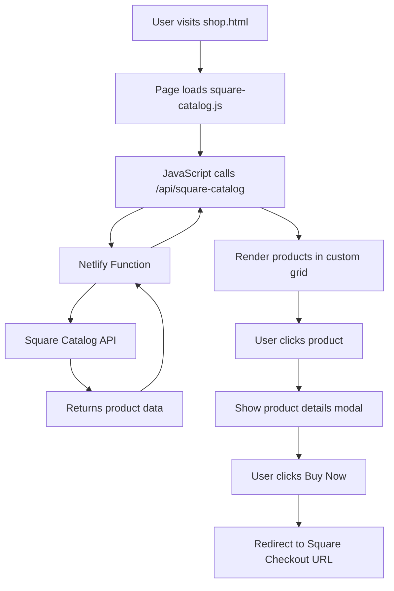

# Square Catalog API Integration Plan

## Overview
Replace the embedded payment link with a dynamic catalog display that fetches products from Square's Catalog API, displays them in a custom grid matching the site's design, and redirects users to Square checkout for purchases.

## Architecture



## Technical Implementation

### 1. Serverless Function Architecture

**File Structure:**
```
netlify/
  functions/
    square-catalog.js       # Fetch catalog items
    square-checkout.js      # Generate checkout links
```

**Environment Variables (in Netlify):**
- `SQUARE_ACCESS_TOKEN` - Your Square API access token
- `SQUARE_APPLICATION_ID` - Your Square application ID
- `SQUARE_LOCATION_ID` - Your Square location ID
- `SQUARE_ENVIRONMENT` - "sandbox" or "production"

### 2. Frontend Integration

**New Files:**
- `js/square-catalog.js` - Handles catalog fetching and display
- `css/square-catalog.css` - Styles for catalog grid (optional, can merge into style.css)

**Modified Files:**
- `shop.html` - Add catalog display section
- `css/style.css` - Add catalog card styles

### 3. Data Flow

1. **Page Load:**
   - User visits shop.html
   - JavaScript calls `/api/square-catalog`
   - Serverless function authenticates with Square API
   - Returns catalog items (name, description, price, image, variations)

2. **Display:**
   - Render products in grid matching existing design aesthetic
   - Show product images, names, prices
   - Display "View Details" or "Buy Now" buttons

3. **Purchase Flow:**
   - User clicks product → Modal shows details
   - User selects variations (size, color if applicable)
   - Click "Buy Now" → Redirect to Square checkout URL with selected variation

### 4. Square API Endpoints Used

- **List Catalog:** `GET /v2/catalog/list?types=ITEM`
  - Fetches all products in catalog
  - Returns items with variations, pricing, images

- **Retrieve Catalog Object:** `GET /v2/catalog/object/{object_id}`
  - Get detailed info for specific product

- **Create Checkout:** `POST /v2/online-checkout/payment-links`
  - Generate payment link for specific product/variation
  - Returns checkout URL to redirect user

### 5. Product Card Design

Match existing design system:
- Pink gradient buttons (--pink-deep to --pink-mid)
- Card shadows (--shadow)
- Border radius (--radius)
- Hover effects with translateY
- Responsive grid layout

### 6. Error Handling

- Loading states with spinner/skeleton
- Error messages if API fails
- Fallback to contact form if checkout fails
- Retry logic for network errors

### 7. Security Considerations

- Access token stored in Netlify environment variables (never in client code)
- Serverless function validates requests
- CORS headers properly configured
- Rate limiting on API calls

## Implementation Steps

1. **Setup Netlify Functions**
   - Create `netlify/functions/` directory
   - Configure `netlify.toml` for function settings
   - Set up environment variables in Netlify dashboard

2. **Build Serverless Function**
   - Install Square SDK: `npm install square`
   - Implement catalog fetching logic
   - Add error handling and logging
   - Test with Square sandbox

3. **Create Frontend Module**
   - Build `square-catalog.js` to call serverless function
   - Implement product grid rendering
   - Add loading and error states
   - Create product detail modal

4. **Style Integration**
   - Design catalog cards matching site aesthetic
   - Ensure responsive layout
   - Add hover effects and transitions
   - Test on mobile devices

5. **Checkout Integration**
   - Implement variation selection (if needed)
   - Generate Square checkout URLs
   - Handle redirect to Square payment page
   - Add success/cancel return URLs

6. **Testing**
   - Test with Square sandbox environment
   - Verify all products display correctly
   - Test checkout flow end-to-end
   - Check mobile responsiveness
   - Validate error handling

7. **Documentation**
   - Update README with setup instructions
   - Document environment variables
   - Add troubleshooting guide
   - Include Square dashboard setup steps

## Benefits of This Approach

✅ **Secure:** API credentials never exposed to client
✅ **Scalable:** Serverless functions auto-scale
✅ **Maintainable:** Products managed in Square dashboard
✅ **Professional:** Custom design matching brand
✅ **Cost-effective:** Netlify free tier includes functions
✅ **Real-time:** Always shows current inventory and pricing

## Alternative Approaches Considered

1. **Square's Embedded Catalog Widget**
   - ❌ Limited customization
   - ❌ Doesn't match site design
   - ✅ Easier to implement

2. **Client-side API Calls**
   - ❌ Exposes API credentials
   - ❌ Security risk
   - ✅ Simpler architecture

3. **Full Backend Server**
   - ❌ More complex deployment
   - ❌ Higher hosting costs
   - ✅ More control

**Chosen approach (Serverless + Custom Frontend) provides the best balance of security, customization, and simplicity.**

## Next Steps

After plan approval, switch to Code mode to implement:
1. Netlify Functions setup
2. Square API integration
3. Frontend catalog display
4. Checkout flow
5. Testing and documentation